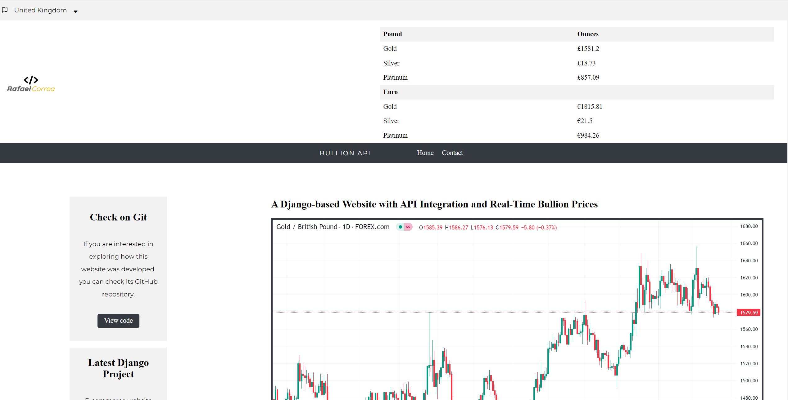
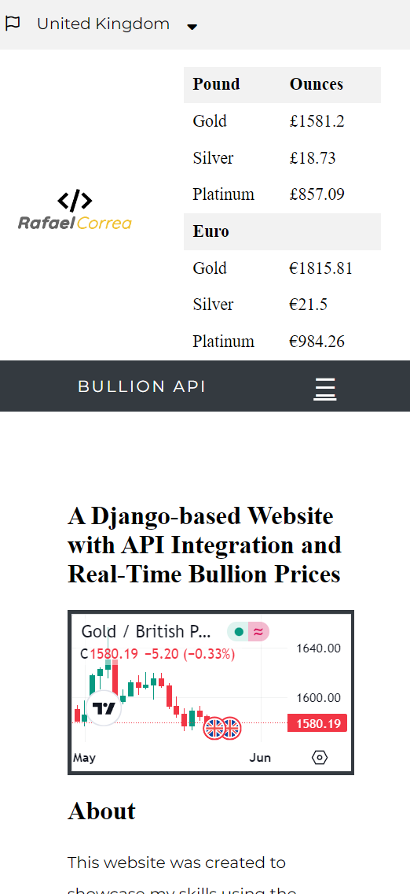

This website was created to showcase my skills using the Django framework, Python, SASS, JS, HTML, CSS, and API integration. Due to time limitations, I was only able to include one app, but with more time, I plan to add an authentication system and other apps such as a blog, purchase system, and contact page. To build this site, I used two APIs. The first API, provided by Metal Price API, is used in the header to display real-time bullion prices. I programmed it to show prices in ounces for three different metals in both GBP and EUR. The second API, provided by TradingView, is used to show the GOLD/GBP chart. In addition, the website offers a second language option (Portuguese).

note: The free subscription for the bullion price API allows a maximum of 100 requests.

### Desktop

### Mobile

